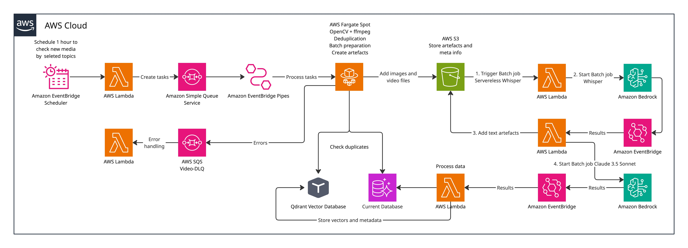

# Case Study: Game Mechanics Intelligence Pipeline

**Role:** Cloud Solution Architect  
**Domain:** AI/ML, Media Processing, Analytics  
**Stack:** AWS (Fargate Spot, Bedrock, SQS, S3, Lambda, EventBridge), OpenCV, ffmpeg, Whisper, Claude 3.5 Sonnet, Qdrant, PostgreSQL

---

## Background

The client operates an analytics platform for the mobile games market. Their product gives publishers insight into competitor monetization strategies, revenue trends, and feature adoption. One of the existing modules surfaces mechanics screenshots grouped by tags — useful for reference, but lacking depth.

The client wanted to extend this capability: instead of relying on manually curated or sporadically available screenshots, they wanted a system that systematically ingests video content from external sources (primarily YouTube), analyzes gameplay footage, extracts game mechanics with semantic metadata, and feeds the results into their existing analytics data layer.

The ask was not "build a YouTube scraper." It was: **design a scalable, cost-controlled pipeline that turns raw video content into structured, queryable mechanics intelligence**.

---

## Discovery: Questions Before Architecture

Before touching any AWS console, the following needed to be resolved.

**What is the unit of value?**  
A single "mechanic reference" — a combination of visual frames + audio transcript + LLM-generated metadata (genre, sub-genre, tags, short/long description). This atomic unit drives both storage decisions and downstream query patterns.

**How do we select which videos to process?**  
Two valid approaches: (1) start from a curated game list and find associated content, or (2) start from topic tags and find matching videos. Both are valid — the pipeline should be agnostic to this, but the initial scope was defined around a known game catalog rather than open-ended tag discovery. This avoids unbounded ingestion volume.

**What volume are we targeting?**  
The answer to this changes the architecture significantly. At ~100 videos/day, a simple Lambda-based approach works fine. At ~10,000 videos/day, you hit IP blocking, token budget ceilings, and S3 egress costs. The initial PoC targets a few hundred per day with a design that can scale. The architecture below reflects that middle ground.

**What do we actually need from the video?**  
Not the whole video. Most footage contains UI overlays, loading screens, and commentary that are irrelevant. The system needs to extract: meaningful frame sequences (scene changes with app UI visible), audio transcript, and per-video metadata. Everything else is noise and paid inference budget.

**What are the legal constraints?**  
YouTube's ToS prohibits scraping. The client accepted this as a known risk, consistent with how many analytics platforms in this category operate. Proxy rotation and request throttling are operational mitigations. Legal risk is owned by the client.

**What does "deduplication" mean here?**  
Two levels: video-level (don't reprocess a video already in the system) and frame-level (don't run inference on visually identical frames from different videos). Both are addressable — video-level via hashing, frame-level via vector similarity in Qdrant before sending to the model.

---

## Back-of-Napkin Estimates

Assumptions for sizing:
- 300 videos/day, average 8 minutes each
- ffmpeg scene detection: ~1 significant frame per 5 seconds → ~96 frames/video
- After deduplication and filtering: ~40 frames submitted to VLM per video
- Claude 3.5 Sonnet via Bedrock Batch: ~$0.0008 per 1K input tokens; image tokens ~$0.00265 per image
- Whisper transcription: ~$0.006/minute on self-hosted faster-whisper; negligible on 8-min average
- Fargate Spot (1 vCPU / 2GB): ~$0.013/hour; ffmpeg+OpenCV job per video: ~3 min → ~$0.00065/video

| Component | Daily cost (300 videos) |
|---|---|
| Fargate Spot (video processing) | ~$0.20 |
| Bedrock Batch (VLM inference) | ~$3.20 |
| S3 storage (frames + artifacts) | ~$0.15/day growth |
| Lambda + SQS | negligible |
| **Total approx.** | **~$3.60/day (~$108/month)** |

This is well within reason for a PoC. Bedrock Batch's 50% discount over on-demand is what makes this viable. Fargate Spot handles the CPU-heavy preprocessing at ~70% savings over on-demand.

---

## Tradeoffs Considered

**Fargate Spot vs. Lambda for video processing**  
Lambda has a 15-minute hard limit and limited ephemeral storage. An 8-minute video download + ffmpeg processing easily exceeds safe margins. Fargate Spot gives full container flexibility with no timeout constraints. The tradeoff: slightly more operational complexity (task definition, cluster management), worth it at this scale.

**Bedrock Batch vs. on-demand inference**  
Batch is asynchronous with up to 24h processing window. This is acceptable — the system is inherently async and there's no real-time UI dependency on ingestion. 50% cost reduction is too significant to ignore.

**Serverless Whisper vs. AWS Transcribe**  
AWS Transcribe handles general speech well but struggles with gaming-specific terminology, streamer slang, and game/character names. Serverless Whisper gives better transcription quality for this domain at lower cost, with no persistent infrastructure to manage. The tradeoff: cold start latency on infrequent jobs — acceptable given the fully async nature of the pipeline.

**Qdrant for deduplication vs. hash-only**  
Pure hash deduplication handles exact duplicates. Near-duplicate frames (same screen, slightly different timestamp) still get processed and billed. Qdrant vector similarity check before model invocation eliminates this class of waste. The tradeoff: adds an infrastructure dependency. Given that frame deduplication reduces inference calls by an estimated 20-40%, this pays for itself quickly.

**Full video storage vs. artifacts only**  
Storing raw video is expensive and largely unnecessary after frame extraction. The system stores: extracted keyframes (PNG), transcripts (text), and LLM output (JSON). Raw video is discarded post-processing. This keeps S3 costs manageable and artifacts reusable for future re-analysis without re-downloading.

**Single-source (YouTube) vs. source-agnostic pipeline**  
Designed source-agnostic from day one. The ingestion layer accepts a `{source, video_id, metadata}` envelope. YouTube is the first implementation. TikTok, Twitch VODs, and others can be added without pipeline changes.

---

## Selected Architecture

The diagram below shows the full pipeline:

### Flow Description

**1. Scheduled Discovery**  
EventBridge Scheduler triggers every hour. A Lambda function queries the known game/topic list and identifies new candidate videos. Tasks are written to SQS.

**2. Task Routing**  
EventBridge Pipes connects SQS to downstream processing, handling batching and fan-out. Errors route to a dedicated DLQ (`SQS Video-DLQ`) with a Lambda for error handling and alerting.

**3. Video Processing (Fargate Spot)**  
Each SQS task spawns a Fargate Spot container running:
- `yt-dlp` for video download (with proxy rotation)
- `ffmpeg` for scene change detection (frame extraction at meaningful transition points)
- `OpenCV` for frame quality scoring and sequence optimization
- Deduplication check against Qdrant (vector similarity) and the current database (video-level hash)

Resulting artifacts (frames, transcript jobs) are written to S3.

**4. Transcription (Serverless Whisper)**  
A Lambda triggers a Serverless Whisper batch job. Results are written back to S3 as text artifacts. Serverless Whisper is preferred over AWS Transcribe due to significantly better accuracy on gaming terminology, streamer slang, and proper nouns.

**5. LLM Analysis (Amazon Bedrock — Claude 3.5 Sonnet)**  
A Lambda submits Bedrock Batch inference jobs. Each job receives: 2–4 frames composed into a grid (showing progression), the transcript segment, and a structured prompt requesting genre, sub-genre, tags, short description, long description (from a constrained taxonomy). EventBridge captures Batch job completion events.

**6. Results Processing**  
A Lambda processes Bedrock output: validates structure, resolves taxonomy conflicts, and writes to:
- **Current Database (PostgreSQL)** — structured mechanics records, fully queryable by game, genre, tag
- **Qdrant Vector Database** — frame embeddings for future semantic search and deduplication

**7. Downstream**  
The existing analytics backend queries PostgreSQL for dashboard construction. Qdrant optionally powers a semantic search layer or RAG interface for natural language mechanics queries.

---

## What Was Left Out of Scope (Intentionally)

- **UI/frontend** — assumed to live within the client's existing product; API contract to be defined separately
- **Source integration layer** (yt-dlp proxy rotation, ToS risk management) — operational concern, not architectural
- **Agent-based dashboard generation** — noted as a future option; adds complexity not justified at PoC stage
- **Full data integration** — the pipeline is designed to run standalone; integration points (shared game catalog, correlated revenue data) are a Phase 2 concern

---

## Outcome

The architecture delivers a fully async, cost-controlled pipeline for video-to-mechanics intelligence. At ~$100/month for 300 videos/day processing, the unit economics are viable for a PoC to production path. The system is designed for progressive enhancement: swap hosted Whisper for Transcribe, add new video sources, extend taxonomy, or plug in an agentic query layer — without rearchitecting the core pipeline.

The key architectural decisions — Fargate Spot for preprocessing, Bedrock Batch for inference, Qdrant for pre-inference deduplication, source-agnostic task envelope — directly address the client's constraints: cost predictability, data quality, and extensibility.

